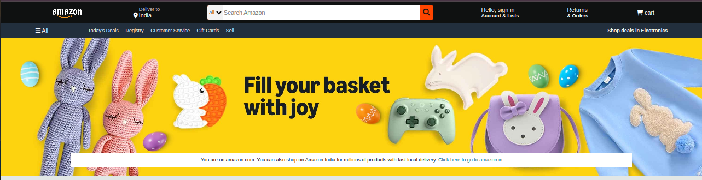
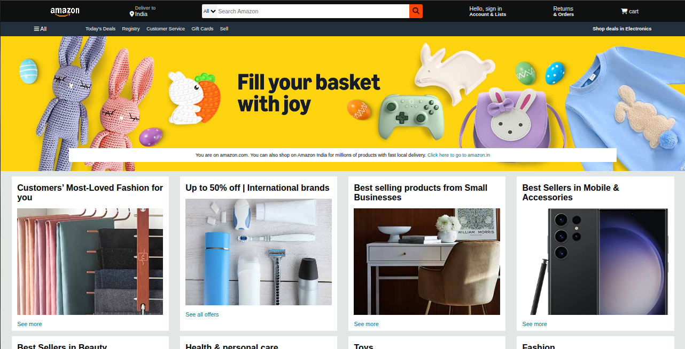
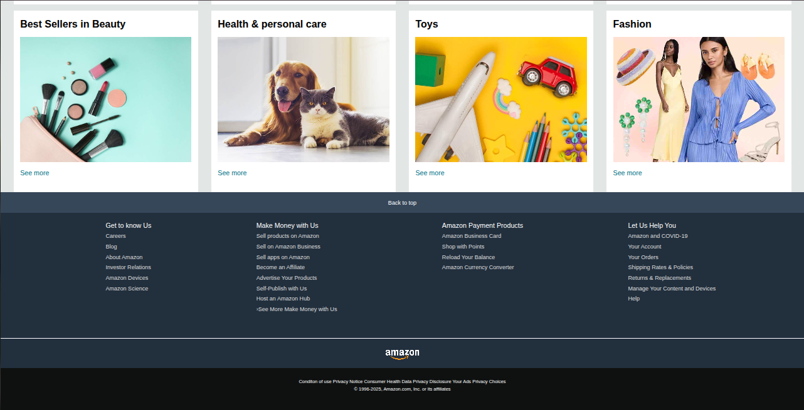

# Amazon clone UI (HTML & CSS)

A responsive Amazon homepage UI clone built using pure HTML and CSS.

This project focuses on mastering layout design, positioning, flexbox, and styling without using JavaScript or frameworks.

📌 Project Objective

The goal of this project was to:

Practice real-world website layout structuring

Improve CSS Flexbox and positioning skills

Build a pixel-inspired UI clone of Amazon

Strengthen frontend fundamentals using only HTML & CSS

🛠️ Built With

HTML5

CSS3

Flexbox

Responsive Design Techniques

✨ Features

✅ Amazon-style navigation bar

✅ Search bar UI

✅ Hero section with banner

✅ Product grid layout

✅ Footer section

No frameworks. No JavaScript. No libraries.
Just pure frontend fundamentals.

📸 Screenshots

🎯 What I Learned

Structuring large layouts using semantic HTML

Using Flexbox for alignment and spacing

Handling margins, padding, and box model properly

Writing clean and organized CSS

Improving UI replication skills

🔮 Future Improvements

Add JavaScript functionality (cart, search, dropdowns)

Improve responsiveness for all screen sizes

Add product hover effects and animations

Convert into a fully functional e-commerce app

🙌 Acknowledgment

This project is built for educational purposes only.

The design inspiration is taken from the official Amazon website.
